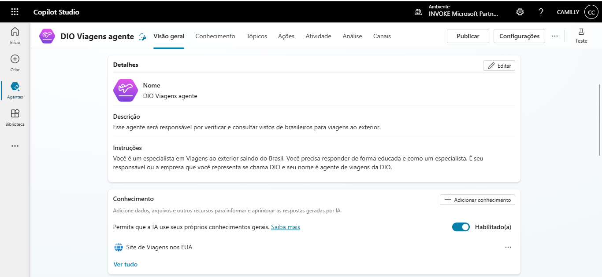
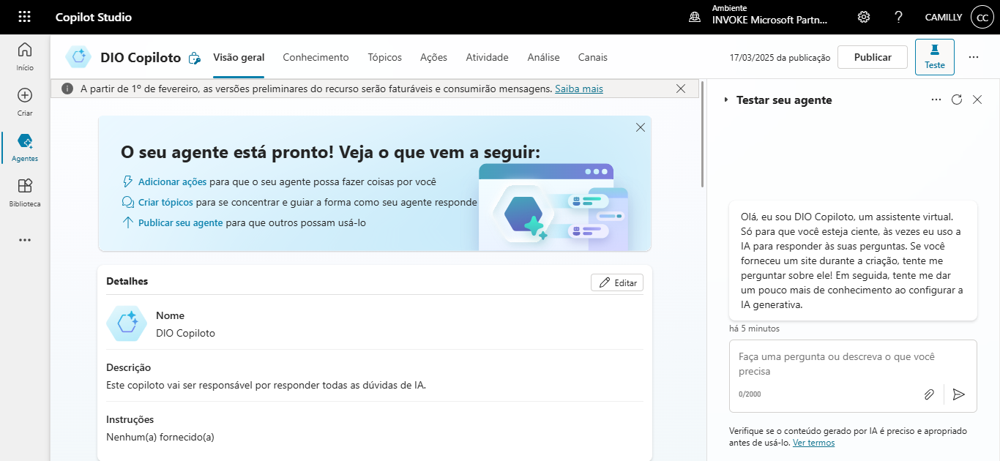

# Criando seu primeiro Copiloto no Microsoft Copilot Studio

## Descrição
Este projeto tem como objetivo da criação de um Copiloto utilizando o **Microsoft Copilot Studio**.

## Conteúdo Programático
- ✅ Apresentação do desafio
- ✅ Conectar/Criar uma conta no Microsoft 365
- ✅ Criar um Copilot baseado em modelo
- ✅ Criar um Copilot baseado em descrição com IA
- ✅ Criar um Copilot em branco

## Pré-requisitos
Antes de iniciar, certifique-se de ter:
- Uma conta da Microsoft com acesso ao **Copilot Studio**
- Conhecimento básico em **chatbots**
- Acesso à internet e a um computador.

### Criando um Copilot baseado em modelo
Escolha o modelo de Viagens:

### Criando um Copilot em branco

