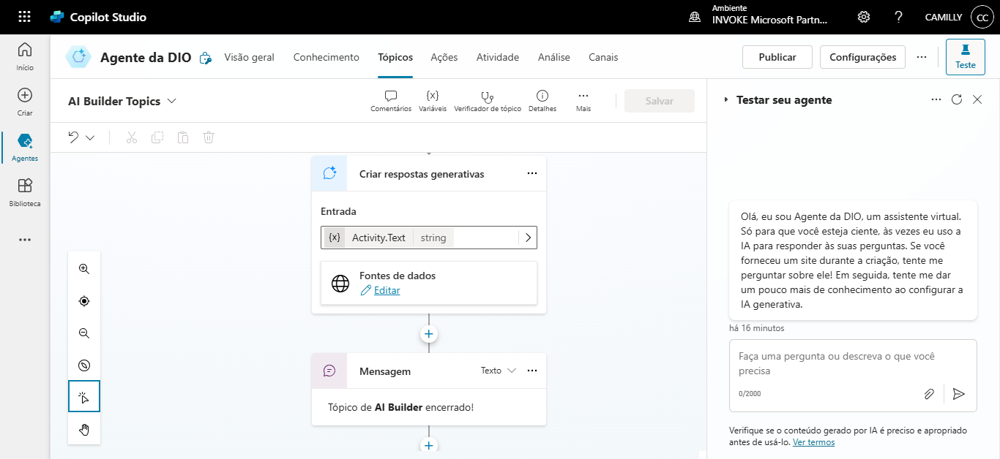

# Criando um Copiloto com Fluxo de Conversa Personalizado no Microsoft Copilot Studio

## Descrição
Este projeto tem como objetivo da criação de um Copiloto com fluxo de conversa personalizado utilizando o **Microsoft Copilot Studio**.

## Conteúdo Programático
- ✅ Apresentação do desafio
- ✅ Criar um Copilot em branco
- ✅ Customizar um tópico
- ✅ Personalizar uma mensagem de erro de tópico
- ✅ Aumentar e diminuir a qualidade da resposta com GenAI

## Pré-requisitos
Antes de iniciar, certifique-se de ter:
- Uma conta da Microsoft com acesso ao **Copilot Studio**
- Conhecimento básico em **chatbots**
- Acesso à internet e a um computador.

### Criando um Copilot em branco

### Customizar um tópico

### Personalizar uma mensagem de erro de tópico
<<<<<<< HEAD

=======

>>>>>>> 8ef980853358ea20bd6431133f54f06005f866a9
